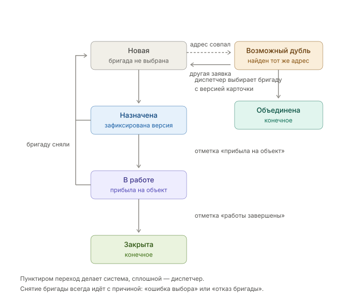

## 1. Что вычитал из материалов

**1.1. Двойные выезды это два разных вида проблем.**

41 случай из выгрузки (приложение Б) делится на две непересекающиеся группы: в одной на адрес завели две карточки заявки, в другой карточка одна, но назначили по ней дважды.

> В спринт нужны как минимум две задачи с общей целью, одной обе проблемы не закрыть.

**1.2. Всё, что нужно для назначения, хранится в головах диспетчеров и в телефонных разговорах, а в системе этого нет.**

Система знает только текущее назначение, а свободна бригада или нет, ей неизвестно. Причина выбора бригады в истории не сохраняется (приложение Г), регламента нет, и у трёх диспетчеров оказалось три разных правила выбора (приложение А).

> Назначать автоматически сейчас не получится: система не знает, кто свободен, а правил выбора нет. Первым шагом становится накопление данных.

**1.3. Полностью диспетчера не убрать, даже когда система научится назначать сама.**

Диспетчеров шесть, работают посменно круглосуточно, и помимо назначения каждый принимает звонки, согласовывает время с клиентом, разбирает переносы и держит связь с бригадами (приложение В).

> Поэтому сосредотачиваемся на сокращении ошибок и затрат на повторные выезды.

**1.4. Экран «Заявки на выезд» не подключён к правам доступа.**

Любой сотрудник видит все заявки и может переназначить любую, хотя сервис прав в платформе работает (приложение Г).

> Берём в спринт с высоким приоритетом: пока прав нет, непонятно, кто менял назначение и имел ли на это право.

**1.5. Есть препятствия для внедрения изменений.**

Приложения для бригад нет, о завершении работ они сообщают голосом, и всех это устраивает (приложение Г). Тамара про автоназначение: «А кому бригада будет звонить, когда откажется? Роботу?» (приложение А).

> В спринте не требуем от бригад нового поведения: телефон остаётся основным каналом, меняем только экран диспетчера. Телефонного робота с одной кнопкой «выехал» или «закончил», самый дешёвый канал обратной связи от бригад, ставлю отдельной работой сразу после спринта.

---

## 2. Чего в материалах не хватает

**2.1. Какая бригада ехала по каждому из 41 назначения.**

В истории бригада хранится, в выгрузку не попала, спросил бы у разработки.

> Главное возражение Лебедевой в том, что система отправит не ту бригаду (приложение А). Есть ли такие промахи уже сейчас, подтвердить не могу: видно только, что заявки пришлись на разные адреса, то есть поломка общая.

**2.2. Время закрытия заявки.**

В истории не хранится, спросил бы у диспетчеров историю звонков.

> В первой группе интервал между назначениями доходит до шести часов, и я не могу отличить двойной выезд от повторного обращения на адрес, где первая бригада давно отработала. Если верно второе, часть суммы из пункта 4 надо снять, а проверку ставить на создании карточки.

**2.3. Тип заявки: аварийная или плановая.**

В выгрузке поля нет, спросил бы у разработки.

> Без него 41 случай не связать с двухчасовым сроком по договорам с управляющими компаниями, а аварийный двойной выезд дороже планового. Это же поле определяет, с какого класса заявок начинать автоматизацию.

**2.4. Как обрабатывается заявка от управляющей компании: письмо разбирает человек или программа.**

Спросил бы у разработки.

> От этого зависит, где чинить адреса, на входе почты или в форме создания карточки, а это разный объём работы. Это единственный открытый вопрос, влияющий на объём спринта, поэтому в 7.1 фиксирую порядок сокращения на случай плохого ответа.

---

## 3. Диагноз по 41 случаю

### **Почему это две разные поломки?**

Самый долгий интервал в группе C это 200 секунд, самый короткий в A и B это 2400 секунд, между ними пусто. Будь причина одна, случаи легли бы сплошняком, а они собраны в два отдельных сгустка.

**1) Группы A и B: адрес не сверяется между заявками.**

Адрес от клиента записывают со слов, от управляющей компании берут из письма, сверки нет (приложение Г), и на один дом заводят две карточки. В трёх случаях обе карточки назначил один и тот же диспетчер (строки 2, 7, 14), значит человек просто не видит, что заявка на этот адрес уже есть.

Решение: приводить адрес к единому виду при создании карточки и показывать диспетчеру активную заявку на этом адресе.

**2) Группа C: два диспетчера берут одну карточку на пересменке.**

Все 17 случаев уложились в 19 минут от пересменки. Это окно составляет 5,5% суток, случайно попасть туда всеми 17 случаями невозможно, а из групп A и B в него не попал ни один. Во всех 17 случаях назначали два разных диспетчера, а источники разделились почти поровну, 9 от управляющих компаний и 8 от клиентов, то есть канал на поломку не влияет.

Решение: отклонять второе назначение, если первое уже сделано и диспетчер его не видел.

---

## 4. Счёт

**Сколько теряем.** Один выезд стоит 8–12 тысяч (приложение В), каждый случай из выгрузки это один лишний выезд.

|Группа|Случаев в месяц|При 8 тыс.|При 10 тыс.|При 12 тыс.|
|-|-|-|-|-|
|A|21|168 000|210 000|252 000|
|B|3|24 000|30 000|36 000|
|C|17|136 000|170 000|204 000|
|**Итого**|**41**|**328 000**|**410 000**|**492 000**|

Для расчётов беру середину, 410 тысяч в месяц: 240 тысяч закрывает сверка адресов, 170 тысяч отклонение повторного назначения.

**Сколько даёт снятие назначения с диспетчеров.** По приложению В назначение занимает 4,7–7,9 часа в сутки, то есть 14–24% месячного фонда в 1000 часов, или 55–92 тысячи при фонде оплаты 390 тысяч. Но эти деньги существуют только на бумаге: убрать назначение не значит убрать человека из смены (пункт 1.3), на деле получаем разгрузку на пике и меньше ошибок от спешки. Штрафы за срыв двухчасового срока почти не взыскиваются (приложение В), в расчёт их не беру.

**С чего начинать.** Сверка адресов и отклонение повторного назначения дают 410 тысяч в месяц против 55–92 тысяч на оптимизации работы диспетчеров, в пять раз больше и дешевле: обе задачи делаются внутри существующего экрана, без приложения для бригад и нового процесса. Выгоду автоназначения посчитать нельзя даже приблизительно, потому что неизвестно, как часто оно будет ошибаться.

---

## 5. Как устроено назначение

### 5.1. Правила и состояния

**Бригаду выбирает диспетчер.** Система не отсеивает бригады и не выделяет рекомендованную: даже для телеинспекции показываются все одиннадцать, просто у трёх стоит метка борта.

Одно правило беру и объявляю допущением. **Принимаю, что при прочих равных первой в списке показывается бригада с наименьшим числом активных заявок.** Это единственное основание, которое можно посчитать из того, что система уже хранит. Правило слабое, зато проверяет само себя: если диспетчеры регулярно выбирают не первую строку, допущение опровергнуто (метрика в 6д).

Состояния заявки:

Если версия карточки устарела, назначение не выполняется, это лечит группу C.

Отметки «на объекте» и «работы завершены» ставит диспетчер вручную после телефонного разговора. Разброс от факта до часа нормален: нам нужна история выездов и время закрытия заявки, которых сегодня нет нигде.

Снятие бригады всегда идёт с причиной: **ошибка выбора** (бригада не подходит) или **отказ бригады** (техника, застряли на предыдущем объекте), плюс необязательный комментарий. Первая говорит о качестве выбора, вторая о ситуации на дорогах, смешивать их нельзя.

### 5.2. Что делает решение автоматизации, что интерфейс

|Действие|Решение автоматизации|Интерфейс|
|-|-|-|
|Приведение адреса к единому виду|приводит, ищет совпадения|показывает найденное|
|Пометка «возможный дубль»|определяет и помечает|отображает пометку|
|Запись назначения|записывает, сверяет версию карточки|передаёт команду, показывает результат|
|Конфликт версий|отклоняет вторую команду, возвращает причину|показывает причину и текущее состояние|
|Отметки «на объекте», «работы завершены»|записывает событие и меняет состояние|передаёт команду, показывает новое состояние|
|Снятие бригады с причиной|записывает причину, возвращает заявку в «Новая»|передаёт команду с причиной и комментарием|
|Права доступа|запрашивает у сервиса прав|скрывает или блокирует действия по ответу|
|Список бригад и порядок в нём|считает загрузку, отдаёт готовый порядок|отображает как пришло|
|Журнал|пишет|показывает|
|Открытие адреса на карте|не участвует|открывает внешнюю карту в новой вкладке|

Интерфейс ничего не создаёт, не хранит и не проверяет: он показывает состояние и передаёт команды.

### 5.3. Откуда взяты правила

|Что|Источник|
|-|-|
|Телеинспекция требует бригаду с бортом, их 3 из 11|из материалов, приложение В. Показываем меткой, не используем как фильтр|
|Пересменки в 08:00 и 20:00|из материалов, приложение Б. Обоснование блокировки повторного назначения|
|Отказ бригады случается по несколько раз в день|из материалов, приложение А (Игорь). Обоснование кнопки «Изменить бригаду»|
|Завершение работ бригада сообщает голосом|из материалов, приложение Г. Обоснование ручных отметок|
|Запрещённые пары «бригада и адрес» существуют и нигде не записаны|из материалов, приложение А (Тамара). В спринте не используем, собираем интервью|
|Порядок показа бригад|допущение. Принимаю, что при прочих равных первой показывается бригада с наименьшим числом активных заявок. Проверяем долей выборов не первой строки; выше половины — сортировку снимаем|
|Роли: наблюдатель, диспетчер, старший диспетчер|допущение. В материалах ролей нет, сказано только, что сервис прав есть и экран к нему не подключён (приложение Г)|
|Окно поиска дубля|допущение. Принимаю 4 часа как рабочее значение, уточним после ответа на вопрос 2.1|
|Деление причин снятия на «ошибка выбора» и «отказ бригады»|допущение. Двух классов хватает на старте. Свободный комментарий нужен затем, чтобы через квартал увидеть, каких классов не хватило|
|Состав справочника бригад|допущение. Минимум из того, что точно известно. Районы и график добываем отдельно|

Район обслуживания в порядок показа не беру: Марина смотрит по районам, но закрепления районов за бригадами в материалах нет и подтверждения от Лебедевой нет. Восстановить правила из истории за 14 месяцев тоже нельзя: там есть выбранная бригада, но нет причины выбора.

### 5.4. Куда это может прийти дальше

Гипотеза, в спринт не входит. Через месяц сбора данных с Лебедевой можно дописать регламент, брошенный в 2023 году, и тогда система сможет применять правило. Дальше видна полная автоматизация: робот принимает звонок, заводит карточку и обзванивает бригадиров. Начинать предлагаю с обзвона бригадиров, потому что реакция клиентов на робота пока неизвестна.

---

## 6. Когда пошло не так

**а) Два назначения на одну заявку.**

Команду назначения принимаем только вместе с версией карточки, которую видел диспетчер. Команда с устаревшей версией отклоняется, в ответ приходит текущее назначение: бригада, кто назначил, во сколько. Диспетчер может назначить заново осознанно, это отдельная запись в журнале. Номер версии не показываем, диспетчеру важно знать только, что его данные устарели и кто успел раньше.

**б) Бригада отказалась.**

Отказ приходит голосом. Диспетчер нажимает «Изменить бригаду» и выбирает причину. «Отказ бригады» возвращает заявку в «Новая» и закрывает эту бригаду для повторного выбора по данной заявке, «ошибка выбора» бригаду не блокирует: диспетчер мог промахнуться, и через минуту эта же бригада может оказаться правильной. Тем же способом отмечаются прибытие на объект и завершение работ. Звонить бригада будет, как и раньше, диспетчеру.

**в) Данные недоступны.**

Если ответа от решения автоматизации нет, список бригад приглушён с пометкой «данные могли устареть, обновлено в ЧЧ:ММ», и назначение не отправляется. Назначать вслепую нельзя, иначе повторим группу C.

**г) Заявка не подходит ни под одно правило.**

Отсеивающих правил у нас нет, поэтому такого состояния не возникает. Бывает другое: подходящей бригады нет физически, например все три борта заняты или ночью некому ехать. Заявка остаётся в «Новая», диспетчер назначает по обстоятельствам или переносит, причина остаётся в комментарии. Эти случаи покажут, каких правил и данных не хватает для регламента.

**д) Система назначила не ту бригаду.**

*Сейчас.* Выбирает диспетчер, отвечает Лебедева, как и до нас. Новое в том, что каждое снятие бригады требует причины и прав, а в журнале видно, кто, когда и почему поменял решение.

*Когда система начнёт назначать.* Метрика «система предлагает не то» это доля снятий с причиной «ошибка выбора», отказы бригад в неё не идут. Диспетчер снимает бригаду той же кнопкой сразу, без согласований, а само правило отключается флагом, без выкладки новой версии.

Вторая метрика работает уже со спринта: доля назначений не на первую строку списка. Она проверяет допущение о загрузке (5.3), и если диспетчеры чаще выбирают не первую, порядок показа снимаем.

---

## 7. Что делаем за один спринт

Бюджет: четыре разработчика по четыре задачи, итого 16, плюс два дня буфера. Спринт убирает потери на двойных выездах и запускает сбор данных, которых в компании нет.

### 7.1. Что берём

|№|Задача|Задач|Что закрывает|
|-|-|-|-|
|1|Версия карточки заявки, отклонение назначения с устаревшей версией|2|группа C, 170 тыс. в месяц|
|2|Экран: конфликт назначения, причина, обновление без перезагрузки, адрес ссылкой на карту|1|группа C, район и удалённость видны диспетчеру|
|3|Приведение адреса к нормализованному виду при создании карточки, включая корпуса|3|группы A и B|
|4|Поиск активной заявки по такому адресу, пометка «возможный дубль»|2|группы A и B, 240 тыс. в месяц|
|5|Экран: предупреждение «на этом адресе уже есть заявка №X, бригада Y», выбор «объединить» или «это другая заявка»|1|группы A и B|
|6|Подключение экрана к правам: наблюдатель, диспетчер, старший диспетчер|2|пункт 1.4 и состояние «недостаточно прав»|
|7|Журнал жизни заявки и отметки диспетчера: назначена, на объекте, работы завершены, смена бригады с причиной и комментарием|3|пункт 6д, время закрытия заявки, история по бригадам|
|8|Справочник бригад, справочные данные в списке и порядок по загрузке|1|допущение 5.3 и метрика к нему|
|9|Приёмка по пунктам 1–8|1||
||**Итого**|**16**||

Параллельно, силами ИТ и без слотов разработки: собрать районы обслуживания, график смен и запрещённые пары «бригада и адрес».

**Что в этом наборе работает на сбор данных.** Комментарий к снятию бригады покажет, с чем диспетчеры сталкиваются на самом деле, и через квартал из него вырастут настоящие категории: какие бригады куда не ездят, где конфликты с председателями, кто на чём специализируется. Сегодня это есть только в голове Тамары. Отметки прибытия и завершения дают длительность выезда и время закрытия заявки (2.1). Адрес ссылкой на карту снижает ошибки сразу: Марина держит город в голове, а другим надо сверяться с картой.

Ответ собственнику:

«Полное исключение диспетчеров сегодня несёт риски для работы компании. Поэтому сейчас сосредоточимся на выявленных проблемах, чтобы убрать расходы в 410 тысяч в месяц на двойных выездах, и начнём собирать данные, по которым система дальше сможет работать в полуавтоматическом режиме под присмотром ключевых сотрудников.»

### 7.2. Что сознательно не берём

**Ранжирование бригад по пригодности.** Район, специализация и близость к адресу требуют правил, которых в компании нет. Такая сортировка была бы догадкой, поданной как экспертное мнение: диспетчер либо поверит и станет работать хуже, либо один раз увидит ерунду и перестанет верить экрану.

**Автоназначение бригады.** То же самое, плюс система не знает, кто свободен, а разбирать ошибки пришлось бы Лебедевой, чего она и опасается.

**Канал статуса от бригады.** Телефонный робот с одной кнопкой (1.5) стоит недорого, но это отдельный контур со своим приёмом звонков, ставлю его следующей работой после спринта.

**Экран управления бригадами.** Раздел администратора со справочником, графиками и статистикой появится позже, это второй экран Центра управления, а нас просили спроектировать один. В спринте справочник живёт таблицей, которую ведёт ИТ.

**Восстановление правил выбора из истории.** Там нет причины выбора, учиться не на чем.

---

## 8. Техническое задание на одну задачу

### 8.1. Какую задачу взял и почему

Задачу 1, версия карточки и отклонение повторного назначения. Только её эффект целиком проверяется на имеющихся данных (17 случаев, 170 тысяч в месяц), и только она не зависит от открытых вопросов из пункта 2.

### 8.2. Цель

Убрать ситуацию, когда два диспетчера назначают бригады на одну карточку, не видя действий друг друга. Целевое значение: ноль таких случаев с интервалом меньше пяти минут за месяц после выкладки, сейчас их 17 в месяц.

### 8.3. Границы

Входит: номер версии у карточки; передача версии в команде назначения; отклонение команды с устаревшей версией и возврат причины; запись отклонённой попытки в журнал.

Не входит: поиск дублей по адресу (задача 4); справочник и порядок списка (задача 8); отметки статуса и смена бригады (задача 7); права доступа (задача 6).

### 8.4. Функциональные требования

1. Карточка заявки имеет номер версии, который растёт при любом изменении назначения, включая снятие бригады.

2. Интерфейс получает версию вместе с карточкой и передаёт её обратно в команде назначения, пользователю номер не показывается.

3. Команда назначения выполняется, только если переданная версия совпадает с текущей.

4. При отклонении возвращается причина, текущее назначение (бригада, диспетчер, время) и обновлённое состояние карточки.

5. Интерфейс показывает конфликт человеческим текстом, без служебных номеров, и не повторяет команду сам.

6. Каждая попытка назначения, успешная и отклонённая, пишется в журнал: заявка, диспетчер, время, версия, результат.

7. После отклонения диспетчер может назначить заново, это отдельная запись в журнале.

8. Требование действует для всех заявок независимо от канала и типа работ.

### 8.5. Критерии приёмки

|Критерий|Как проверим|
|-|-|
|Версия растёт при каждом изменении назначения|Руками: назначить бригаду, снять, назначить другую. В журнале три записи с версиями N, N+1, N+2|
|Назначение с актуальной версией проходит|Руками: открыть карточку, назначить бригаду. Назначение записано, версия выросла на единицу|
|Назначение с устаревшей версией отклоняется|Руками: открыть одну карточку в двух сессиях. Назначить в первой. Во второй попытаться назначить. Команда отклонена, первое назначение не изменилось|
|В отказе видно, кто назначил и какую бригаду|Руками: на экране отклонения указаны бригада, имя диспетчера и время. Служебных номеров версии в тексте нет|
|После отказа повторная отправка невозможна|Руками: пока показан конфликт, список бригад закрыт, второй раз отправить нечего|
|Отклонённая попытка попадает в журнал|Руками: есть запись с результатом «отклонено», указаны диспетчер и переданная версия|
|Переназначение после отказа работает|Руками: нажать «Переназначить». Список открывается заново, назначение с актуальной версией проходит|
|Одновременная отправка|Автотестом, руками не воспроизвести: две команды на одну карточку с одинаковой версией уходят одновременно. Одна выполнена, вторая отклонена. Тест сдаётся вместе с задачей|

### 8.6. Сценарии проверки

**Сценарий 1, позитивный. Обычное назначение.**

Диспетчер открывает заявку №100 в состоянии «Новая» и выбирает бригаду 4. Ожидается: заявка «Назначена», в журнале одна запись, версия карточки выросла на единицу.

**Сценарий 2, негативный. Гонка на пересменке, случай №35 из выгрузки.**

Игорь в 08:19:00 назначает на заявку №101 бригаду 2, Ольга в 08:19:30, не обновляя экран, назначает бригаду 7. Ожидается: назначена бригада 2, команда Ольги отклонена, Ольга видит «заявку уже назначил Игорь в 08:19, бригада 2, Гаврилов». В журнале две записи, второй выезд не создан.

**Сценарий 3, негативный. Забытая вкладка.**

Диспетчер открыл заявку №102 и не трогал экран 40 минут, а за это время другой диспетчер назначил бригаду и снял её, а первый теперь пытается назначить. Ожидается: команда отклонена, показано текущее состояние («Новая») и действие «Обновить и назначить», после обновления назначение проходит.

---

## 9. Порог автономности

Чтобы разрешить системе назначать самой, надо знать, что считать правильным назначением, а этого в компании не знает никто, поэтому порядок такой.

**Шаг 1, спринт. Собираем данные.** Отметки диспетчера дают длительность выездов, время закрытия заявки и причины смены бригады, плюс справочник: районы, график смен, запрещённые пары.

**Шаг 2, сразу после спринта. Канал статуса от бригады.** Телефонный робот с одной кнопкой (1.5). Пока о выезде и завершении знает только диспетчер, система не понимает, кто свободен, а значит не может выбрать.

**Шаг 3, примерно через месяц. Пишем правило.** Заканчиваем с Лебедевой регламент, брошенный в 2023 году, теперь опираясь на цифры. Правило подписывает владелец процесса, иначе оно ничем не отличается от привычки Марины.

**Шаг 4. Проверяем правило, ничего не назначая.** Система показывает, кого выбрала бы она, диспетчер выбирает сам, обе записи сохраняются. Порог: не меньше 95% совпадений на 2000 назначениях подряд за четыре недели и ни одного попадания в запрещённую пару.

**Шаг 5. Включаем только там, где дёшево ошибиться.** Плановые заявки, их 102 из 120 в сутки. Аварийные с двухчасовым сроком остаются за диспетчером: цена ошибки выше, а 18 заявок в сутки мало для статистики. Условие входа: статус приходит не меньше чем по 98% выездов от самой бригады.

**Как выключаем.** Если доля снятий с причиной «ошибка выбора» за неделю превысила 10%, автоназначение выключается флагом и возвращается в режим показа. Решение принимает Лебедева, без согласования с ИТ.

Оговорка про сам порог: сравнивать мы будем с решением опытного диспетчера, и 95% совпадений скажут только, что система повторяет практику компании, а не что она назначает лучше всех.

---

## **10. Прототип**

[https://cyber-siberian.github.io/ks-test](https://cyber-siberian.github.io/ks-test)

